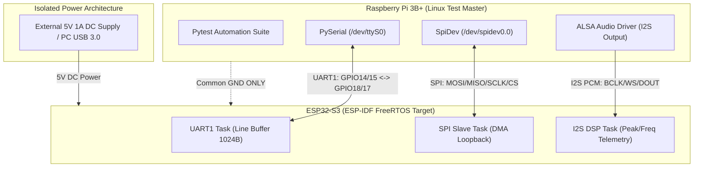

# Hardware-in-the-Loop (HIL) Integrity Validation Framework

A robust, production-grade Hardware-in-the-Loop (HIL) automated test framework designed for physical protocol validation (UART, SPI, I2S/PCM) between a Linux Master (**Raspberry Pi 3B+**) and an Embedded Target (**ESP32-S3** running ESP-IDF).

Designed for high-reliability embedded software testing, telemetry monitoring, and signal purity analysis.

---

## Architecture Overview



---

## Hardware Pinout & Wiring Matrix

> **IMPORTANT POWER SAFETY NOTE:** To prevent ground loops and Raspberry Pi PMIC brownout resets (`Broken pipe`), the ESP32-S3 is powered independently via an external 5V 1A adapter or PC USB 3.0 port. The 5V pin on the Raspberry Pi expansion header is disconnected. A Common GND wire is strictly connected between both boards.

| Protocol | Signal Name | Raspberry Pi 3B+ (Physical Pin) | ESP32-S3 Pin | Notes |
| :--- | :--- | :--- | :--- | :--- |
| **UART** | TX / RX | GPIO 14 (Pin 8) | GPIO 18 (RX) | Cross-connected |
| **UART** | RX / TX | GPIO 15 (Pin 10) | GPIO 17 (TX) | Cross-connected |
| **SPI** | MOSI | GPIO 10 (Pin 19) | GPIO 11 | SPI Slave Mode |
| **SPI** | MISO | GPIO 9 (Pin 21) | GPIO 13 | Full-Duplex Loopback |
| **SPI** | SCLK | GPIO 11 (Pin 23) | GPIO 12 | Hardware Clock |
| **SPI** | CS0 | GPIO 8 (Pin 24) | GPIO 10 | Chip Select |
| **I2S** | BCLK | GPIO 18 (Pin 12) | GPIO 4 | Bit Clock |
| **I2S** | WS / LRCLK | GPIO 19 (Pin 35) | GPIO 5 | Word Select |
| **I2S** | DOUT | GPIO 21 (Pin 40) | GPIO 6 | Audio Data Line |
| **GND** | Common Ground | Pin 6 / 14 / 34 | GND | Mandatory Shared Reference |

---

## System Configuration & OS Hardening

To ensure deterministic communication over the physical `/dev/ttyS0` serial interface, the Raspberry Pi OS environment has been hardened:

* **Linux Serial Console Disabled:** `serial-getty@ttyS0.service` is masked to prevent kernel login prompts from corrupting the test payload.
* **Core Frequency Lock:** Added `core_freq=250` in `/boot/config.txt` to fix the Mini-UART clock baud rate during CPU frequency scaling.
* **ESP32 Firmware Line Buffering:** Implemented a 1024-byte line buffer in ESP-IDF `uart_task` with frame termination processing (`\r\n`) and overflow protection.

---

## Test Execution Suite & Results

All physical protocol interfaces are validated using pytest with 100% pass rate:

```bash
pytest -s -v tests/ --port /dev/ttyS0
```

### Verified Test Matrix (9/9 Passed)

```text
tests/i2s/test_i2s_integrity.py::test_i2s_pcm_audio_transmission PASSED
tests/i2s/test_i2s_integrity.py::test_i2s_frequency_accuracy     PASSED
tests/spi/test_spi_integrity.py::test_spi_two_phase_echo_10bytes PASSED
tests/uart/test_uart_echo.py::test_uart_simple_echo              PASSED
tests/uart/test_uart_modular.py::test_uart_total_integrity       PASSED
tests/uart/test_uart_stress.py::test_uart_stress_matrix[16]      PASSED
tests/uart/test_uart_stress.py::test_uart_stress_matrix[64]      PASSED
tests/uart/test_uart_stress.py::test_uart_stress_matrix[128]     PASSED
tests/uart/test_uart_stress.py::test_uart_stress_matrix[256]     PASSED
```

### Key Test Features

* **I2S PCM Validation:** Generates synthetic sine wave audio frames via ALSA and verifies frequency accuracy and peak amplitude processing on ESP32 DSP task.
* **SPI Full-Duplex Loopback:** Transmits 10-byte payloads over hardware SPI DMA channel and verifies strict frame reflection.
* **UART Signal Integrity Analyzer:** `UARTIntegrityAnalyzer` detects pre-data line noise, payload corruption, and post-transmission trailing garbage.
* **UART Buffer Stress Matrix:** Validates hardware FIFO and software line buffers against variable payload lengths up to 256 bytes.