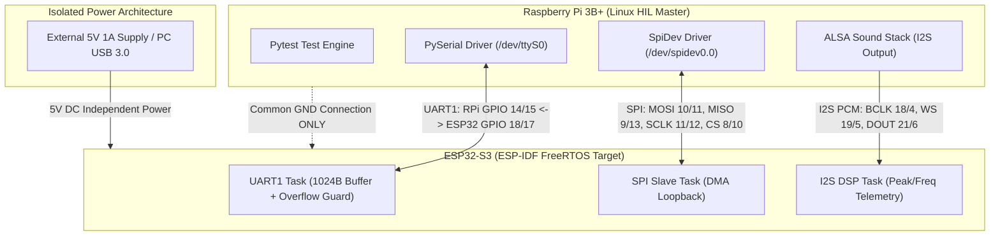

# System Architecture & Hardware Integration Specification

## 1. System Overview

The HIL Integrity Framework is a production-grade, Hardware-in-the-Loop (HIL) automated test suite engineered for physical protocol validation (I2S, SPI, UART) between a HIL Master Node (Raspberry Pi 3B+) and an Embedded Target Node (ESP32-S3 microcontroller running ESP-IDF FreeRTOS).



---

## 2. Hardware & Power Integration Architecture

### 2.1 Isolated Power Supply & Ground Loop Prevention

To prevent ground loops, power rail interference, and Raspberry Pi PMIC brownout resets (`Broken pipe` / SSH dropouts), the framework enforces an Isolated Power Architecture:

* **Target Power:** The ESP32-S3 is powered independently using an external 5V 1A DC adapter or a dedicated PC USB 3.0 port.
* **Header Isolation:** The 5V supply pin on the Raspberry Pi 40-pin GPIO expansion header is explicitly disconnected.
* **Common Ground:** A single-point Common GND Connection is established between Raspberry Pi GND (Pins 6/14/34) and ESP32-S3 GND to ensure identical 0V logic references across all high-frequency signal buses.

### 2.2 Physical Pinout & Interface Mapping Matrix

| Bus Protocol | Signal Name | Raspberry Pi 3B+ Pin | ESP32-S3 Pin | Hardware Description |
| :--- | :--- | :--- | :--- | :--- |
| **UART1** | TXD / RXD | GPIO 14 (Pin 8) | GPIO 18 (RX) | Control plane / HIL command link |
| **UART1** | RXD / TXD | GPIO 15 (Pin 10) | GPIO 17 (TX) | Telemetry & challenge-response output |
| **SPI0** | MOSI | GPIO 10 (Pin 19) | GPIO 11 | Master Out Slave In (10B payload) |
| **SPI0** | MISO | GPIO 9 (Pin 21) | GPIO 13 | Master In Slave Out (DMA mirror) |
| **SPI0** | SCLK | GPIO 11 (Pin 23) | GPIO 12 | Hardware SPI Serial Clock (1 MHz) |
| **SPI0** | CS0 | GPIO 8 (Pin 24) | GPIO 10 | Chip Select (Active Low) |
| **I2S PCM** | BCLK | GPIO 18 (Pin 12) | GPIO 4 | Bit Clock (2.8224 MHz) |
| **I2S PCM** | WS / LRCLK | GPIO 19 (Pin 35) | GPIO 5 | Word Select / Frame Clock (44.1 kHz) |
| **I2S PCM** | DOUT | GPIO 21 (Pin 40) | GPIO 6 | Serial Audio Data Output |
| **GND** | Ground | Pin 6 / 14 / 34 | GND | Common Reference Ground |

---

## 3. Linux OS Hardening & Driver Configuration (Raspberry Pi)

To ensure deterministic serial communication over `/dev/ttyS0` without OS kernel interference:

* **Serial Console Disablement:** The Linux kernel serial console (`console=ttyS0,115200`) is removed from `/boot/cmdline.txt`, and `serial-getty@ttyS0.service` is masked in systemd.
* **Mini-UART Baud Rate Stabilization:** Added `core_freq=250` to `/boot/config.txt`. This locks the VPU core frequency on the BCM2835 SoC, preventing baud rate drift during dynamic CPU frequency scaling.
* **ALSA Audio Subsystem Integration:** The BCM2835 I2S sound card overlay (`dtoverlay=hifiberry-dac`) drives 16-bit 44.1 kHz PCM audio through the ALSA `plughw` device using non-blocking asynchronous execution (`subprocess.Popen`).

---

## 4. Firmware Software Architecture & FreeRTOS Multi-Threading (ESP32-S3)

The ESP32-S3 target firmware (`firmware/main/main.c`) runs three concurrent FreeRTOS tasks:

```text
+-----------------------------------------------------------------------------------+
|                            ESP32-S3 FREERTOS ARCHITECTURE                         |
|                                                                                   |
|  +-----------------------------------------------------------------------------+  |
|  | uart_task (Priority 5, Dedicated HIL UART1)                                 |  |
|  | - 1024-Byte static line buffer (`line_buf`)                                 |  |
|  | - Buffer overflow protection (`line_pos >= sizeof(line_buf) - 1`)          |  |
|  | - Command parser: `UART_PING\n` -> `UART_PONG\r\n`                         |  |
|  | - Direct telemetry output writer (`uart_write_bytes`)                       |  |
|  +-----------------------------------------------------------------------------+  |
|                                                                                   |
|  +-----------------------------------------------------------------------------+  |
|  | spi_slave_task (Priority 4, SPI Host 2 DMA)                                |  |
|  | - Configures SPI Mode 0 in Slave Mode                                       |  |
|  | - Listens on MOSI, copies payload into MISO buffer for Full-Duplex mirror   |  |
|  +-----------------------------------------------------------------------------+  |
|                                                                                   |
|  +-----------------------------------------------------------------------------+  |
|  | i2s_dsp_processing_task (Priority 3, I2S0 DMA Engine)                       |  |
|  | - Samples 1024 PCM audio slots from DMA ring buffer                         |  |
|  | - Calculates Peak Amplitude & RMS Power                                     |  |
|  | - Executes Hysteresis Zero-Crossing State Machine (Frequency Estimation)    |  |
|  | - Formats and transmits `I2S_TELEMETRY` over UART1                           |  |
|  +-----------------------------------------------------------------------------+  |
+-----------------------------------------------------------------------------------+
```

### 4.1 Real-Time Hysteresis DSP Zero-Crossing Algorithm

To eliminate jumper wire noise and contact bounce, the zero-crossing detector implements dual-threshold hysteresis:

* Transition to HIGH state occurs only when $\text{Sample} > +1000\text{ LSB}$.
* Transition to LOW state occurs only when $\text{Sample} < -1000\text{ LSB}$.

$$\text{Frequency (Hz)} = \frac{\text{Zero Crossings}}{2 \cdot \text{Buffer Duration (s)}}$$